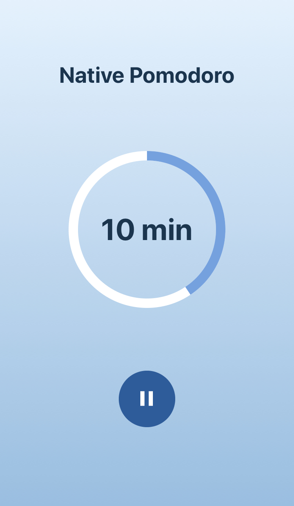

# Native Pomodoro :tomato:


> Application to use the pomodoro technique

:tomato: Pomodoro timer with react native using the expo :alarm_clock:

## Table of Contents

- [Screenshots](#screenshots)
- [Technologies](#technologies)
- [Installation](#installation)
- [Usage](#usage)
- [License](#license)

## Screenshots


_Welcome screen_



_Timer screen_

## Technologies

- [React Native](https://reactnative.dev/)
- [Typscript](https://www.typescriptlang.org/)
- [Expo](https://expo.io/)
- [React Navigation](https://reactnavigation.org/)
- [Eslint](https://eslint.org/)
- [Husky](https://github.com/typicode/husky)
- [Conventional Commits](https://www.conventionalcommits.org/en/v1.0.0/)

## Installation

To run the application it is necessary to have installed the expo-cli. To do this, just run the commands below.

```bash
npm install -g expo-cli
```

Clone the project with the command

```bash
npm install
```

Running the application

```bash
expo start
```

To run the application on your mobile phone just install the [Expo Client](https://apps.apple.com/br/app/expo-client/id982107779) application for iPhone or [Expo](https://play.google.com/store/apps/details?id=host.exp.exponent) for Android and read the QR code with the device's camera.

## Usage

## License

[MIT](LICENSE) © [Anderson Santos](https://github.com/zander-br/)
