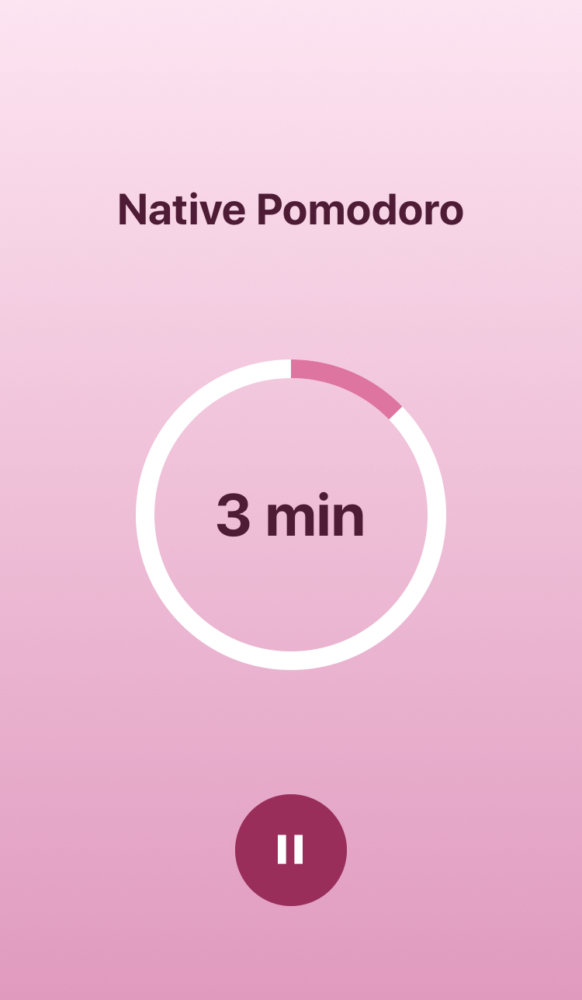

# Native Pomodoro :tomato:

> Application to use the pomodoro technique

:tomato: Pomodoro timer with react native using the expo :alarm_clock:

## Table of Contents

- [Screenshots](#screenshots)
- [Technologies](#technologies)
- [Installation](#installation)
- [Usage](#usage)
- [License](#license)

## Screenshots

_Welcome screen_

_Timer screen_

## Technologies

- [React Native](https://reactnative.dev/)
- [Typscript](https://www.typescriptlang.org/)
- [Expo](https://expo.io/)
- [React Navigation](https://reactnavigation.org/)
- [Eslint](https://eslint.org/)
- [Husky](https://github.com/typicode/husky)
- [Conventional Commits](https://www.conventionalcommits.org/en/v1.0.0/)

## Installation

## Usage

## License

[MIT](LICENSE) © [Anderson Santos](https://github.com/zander-br/)
